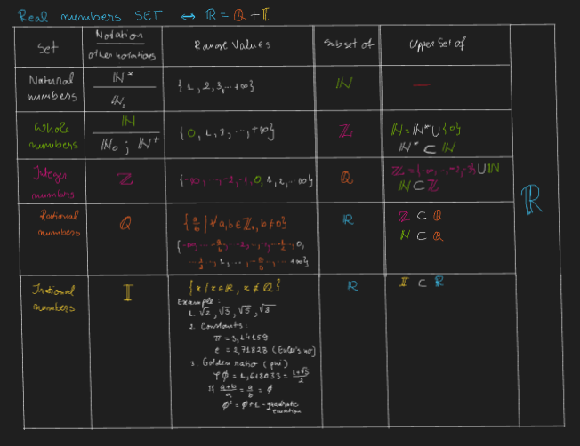

# Basic math
-------------------------------------------------------------------------------
## Digits
0, 1, 2, 3, 4, 5, 6 , 7, 8, 9, 10

-------------------------------------------------------------------------------
-------------------------------------------------------------------------------
## Numbers 
### A. Number Sets
1. Natural Numbers - Common counting numbers.
2. Whole Numbers - The set of Natural Numbers with the number 0 adjoined.
3. Integers - Whole Numbers with their opposites (negative numbers) adjoined.
4. Rational Numbers - All numbers which can be written as fractions.
5. Irrational Numbers - All numbers which cannot be written as fractions.
6. Real Numbers - The set of Rational Numbers with the set of Irrational Numbers adjoined.

-------------------------------------------------------------------------------
-------------------------------------------------------------------------------
### B. Basic Operations
Classification by grade:
1. Grade 1: + and - (A and S)
1. Grade 2: * and / (M and D)
1. Grade 3: Exponent $^{b}$ - the power of a number (E)

#### Operations order (P)
Operations are performed from grade 3 to grade 1
#### Enforce operations order
Operations order are enforced using Parentheses
Parentheses are performed in the next order:
1. ()
1. []
1. \{}
> Example:
> 
> Calculate expression E
> 
> $E = 1 + \\{2^{18} - 2^3 * [2^{25} / (5 * 2^{10} - 1024) + 2^{13}]\\}$
>
> Solution:
>
> $1^{th}$ perform operations in () => $(5 * 2^{10} - 1024) = 5 * 1024 - 1024 = 4 * 1024 = 2^{2} * 2^{10} = 2^{12}$
>
> => $E = 1 + \\{2^{18} - 2^3 * [2^{25} / 2^{12} + 2^{13}]\\}$
> 
> $2^{nd}$ perform operations in [] => $[2^{25} / 2^{12} + 2^{13}] = 2^{13} + 2^{13} = 2^{13} * (2 + 2) = 2^{13} * 2^{2} = 2^{15}$ 
>
> => $E = 1 + \\{2^{18} - 2^3 * 2^{15}\\}$
>
> $3{rd}$  perform operations in {} => $\\{2^{18} - 2^3 * 2^{15}\\} = 2^{18} - 2^{3 + 15} = 2^{18} - 2^{18} = 0
>
> => E = 1 + 0 = 1;

### PEMDAS operation order (Parentheses, Exponent, Multiply, Divide, Add, Subtract)
"Please Excuse My Dear Aunt Sally" - mnemonic to remember the operations order :smiley:

#### Addition properties in N, Z, Q 
1. Additive identity 0
> 0 + a = a + 0 = a

2. Commutativity
> a + b = a + b 

3. Associativity
> (a + b) + c = a + (b + c)

#### Multiplication properties in N, Z, Q 
1. Additive identity 0
> 1 * a = a * 1 = a

2. Commutativity
> a * b = a * b 

3. Associativity
> (a * b) + c = a * (b * c)

4. Zero property - Multiplying any number by 0 the result is zero 
> a * 0 = 0

#### Distributivity of multiplication property - multiplying the sum of two or more numbers is the same as multiplying the addends separately
> $a * (b_{1} + b_{2} + ... + b_{n}) = a * b_{1} + a * b_{2} + ... + a * b_{n}$

#### Exponentiation properties (power):
### 1. $a^{n} * a^{m} = a^{n\\ +\\ m}$
### 2. $a^{n} / a^{m} = a^{n\\ -\\ m}$
### 3. $(a^{n})^{m} = a^{n\\ *\\ m}$
### 4. $(a * b)^{n} = a^n * b^{n}$
### 5. $a^{0} = 1$
### 6. $`a^{-n} = \frac{1}{a^{n}}`$
### 7. $a^{1} = a$
-------------------------------------------------------------------------------
-------------------------------------------------------------------------------
### C. Integer Factorization

#### 1. Fundamental theorem or arithmetic (also known as Unique Factorization theorem or prime factorization theorem):
Every Integer grater then 1 can be represented uniquely a product of prime numbers.

### $a = f_{1}^{p_{1}} * f_{2}^{p_{2}} * ... * f_{n}^{p_{n}}$
#### 2. Total numbers of factors of a an integer 

### $T_{factors}= (p_{1} + 1) * (p_{2} + 1) * ... * (p_{n} + 1)$

