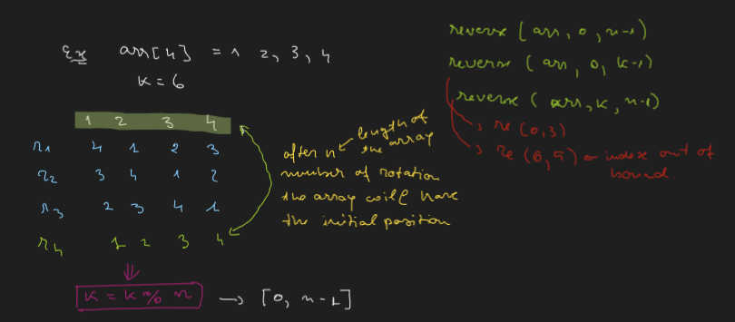
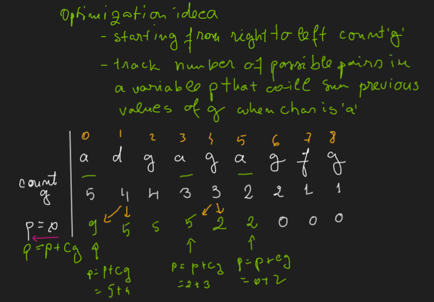
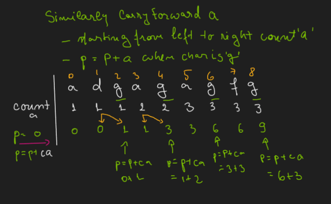

# Session 1
### Content
1. Number of operations calculation
2. Factors in a number: any number that divide a given number is a factor of that number
3. Prime numbers - numbers that have only 2 factors (1 and the number itself)
4. $log_{a}b = x => a^x = b$ (To what power we need to raise a to get b?)
> Log formula:
> 1. $log_{a}a^n = n$

### Problems
1. Count factors of a number
2. Is a number prime?
3. Reverse an array
4. Rotate an array K number of times to right

Important notes on optimal solution for Rotate an array k times:

# Session 2 - Time complexity 1
### Content
1. Calculate iterations in a given code
- basic formulas
	- Gauss Summation: $`\displaystyle\sum_{i=1}^{n} i = 1 + 2 + 3 + ... + n = \frac{n(n + 1)}{2}`$
  - Geometric Progression (GP): $`\displaystyle\sum_{i=1}^{n} a = a * r^{1} + a * r^{2} + ... a * r^{n} = \frac{a * (r^{n} - 1)}{r - 1}`$
  - Total number of numbers in integer ranges formulas:
    - $`[a, b] => b - a + 1`$
    - $`(a, b], [a, b) => b - a`$
    - $`(a, b) => b - a + 1`$
  - Power formulas:
    - $a^{n} * a^{m} = a^{n\\ +\\ m}$
    - $a^{n} / a^{m} = a^{n\\ -\\ m}$
    - $(a^{n})^{m} = a^{n\\ *\\ m}$
2. Big O
$1 --> logN --> \sqrt{N} --> N -> N logN --> N \sqrt{N} --> N^{2} --> 2^{N} $
### Problems
1. Quizzes on theory
   
# Session 3 - Time complexity 2
### Content
1. Big O
2. Comparison two algorithms
3. Why we considering high order term
4. TLE - Time Limit Exceeded
5. T.C and S.C (Time Complexity and Space Complexity)
### Problems
1. Quizzes on theory
2. Examples

# Session 4 - Carry Forward
### Content
1. Count pairs
2. leaders in the array
3. N Bulbs
### Problems
1. Calculat numbers of pairs in a string for 2 given chars
    - Brute force
    - Optimal solution from end to start

    - Optimal solution from start to end

1. Number of leaders in an array
    - Brute force: itereate over the array and get max
    - Optimal sol
# Session 5 - Prefix Sum
### Problems
1. Sum Range in a given array for a number of Queries
    - Brute force 
    - Optimal solution
2. Equilibrium problem - LeftSum = RightSum 
3. Count even numbers in ranges for a given array
    - Brute force
    - Optimal solution

# Session 6 - SubArrays
### Content
1. SubArray intro
2. Print all subarrays
3. Print all subarrays sum
4. Return all subarrays sum
5. Few more subarrays Q
### Problems
1. Print Subaray of an array from index start to index end
2. Print Subarray of length l starting from index start
3. Number of subarrays of an array
    - Brute Force
    - Optimal O(n): $`\displaystyle\frac{n(n + 1)}{2}`$
4. Print all subarrays of a givven array
5. Print sumof each subarray for a given array
    - Brute Force approach
    - PrefixSum approach
6. Print sum for each subaray starting from a givven array
7. Print sum for each subarray of a givvent array

# Recursion
### Content
1. Recursion intro
1. Recursion execution
1. Time Complexity of Recursion

### Problems
Ex1: Sum of N numbers
1. Factorial of a number
1. Print numbers from 1 to N
1. Print numbers from N to 1
1. Fobonacci series 

[Recursion VS Iteration](https://www.geeksforgeeks.org/introduction-to-recursion-2/)

| SR No. | Recursion                                      | Iteration                                    |
|--------|------------------------------------------------|----------------------------------------------|
| 1      | Terminates when the base case becomes true.    | Terminates when the condition becomes false. |
| 2      | Used with functions.                           | Used with loops.                             |
| 3      | Every recursive call needs extra space in the stack memory. | Every iteration does not require any extra space. |
| 4      | Smaller code size.                             | Larger code size.                            |