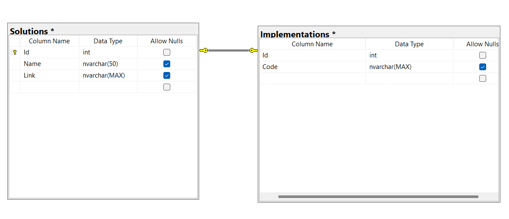

### General
1. Does Prisma needs any prerequisite in order to work? If yes please specify it.
2. Create a folder named Projects
3. Inside projects create a folder named PrismTasks
4. What is the setup prisma command for MsSql?
5. What is the setup prisma command for Microsoft SQL Server?

### Database creation
6. Create a database named PrismaPractice
7. go to .env file and update the connection strig to the new database created
8. create prisma models for 2 tables that have 1:1 relationship following the schema below

### Migrations
9. Run Migration command to create the tables
10. Paste the screenshot with the tables createds